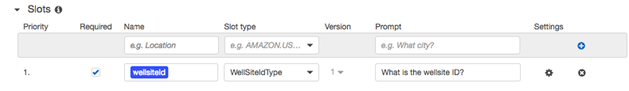
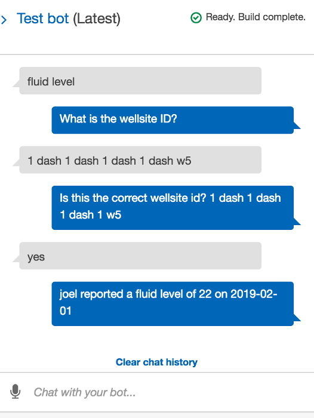
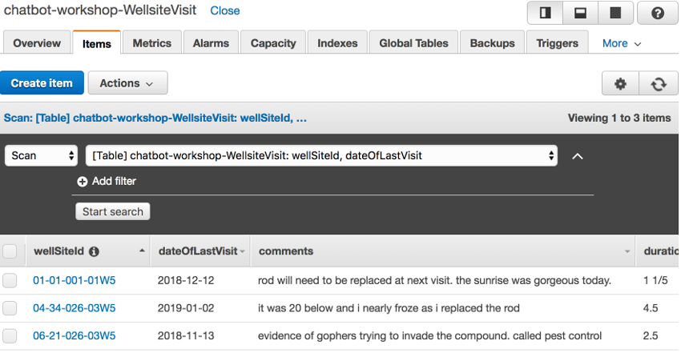
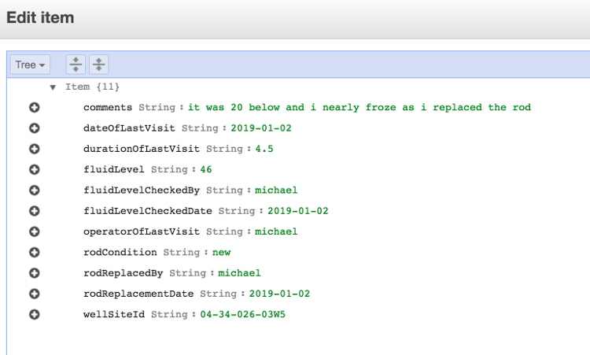
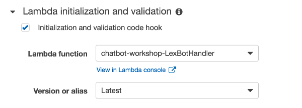
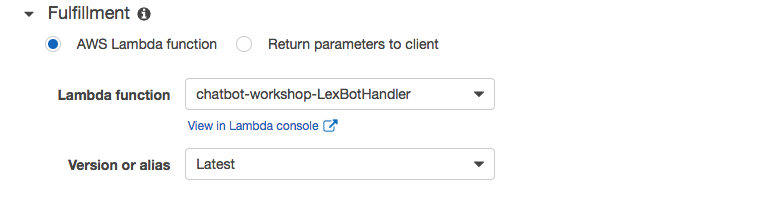
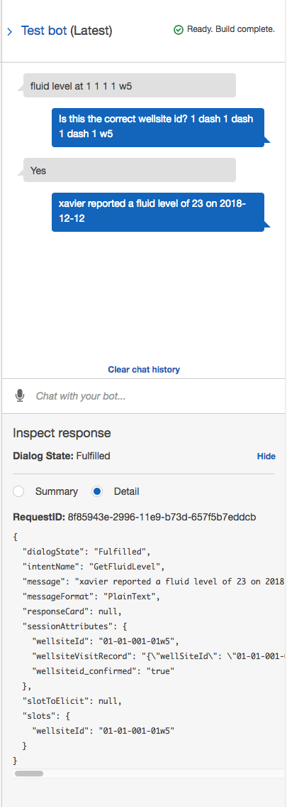
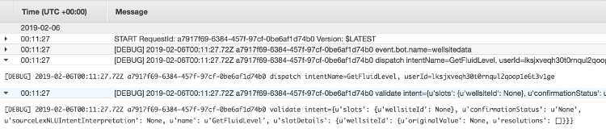

# Module 1: Build a chatbot in Amazon Lex and handle informational queries

In this module you will build a chatbot in Lex and enable it to answer operators' questions about a well site.

At completion of this module you will be able to test out your chatbot in the Lex console by asking questions such as "*What is the fliud level at 01-01-001-01-W5?*

##  Informational queries and chatbots
The first intent you will configure your bot to understand and fulfill will allow your operators to query information about a well site as they prepare to do maintenance. This serves an example for a common use case for chatbots: asking information.

There are two ways you can implement an informational intent: you can make it general or personalize it based on the user. The latter one requires your bot to be able to identity the user the bot is interacting with.

For example, if you build a chatbot that can handle checking the fluid level, the general implementation can handle questions like "*what's the fliud level at 01-01-001-01-W5?*"; whereas if you can identify the user asking the question, the bot can give answers to questions such as "*when was the last time ***I*** checked the fluid level at 01-01-001-01-W5?*"

In later modules, you will try out ways for identifying the user in a Lex bot conversation. For this module, we will stick with these general information queries:

- What is the fluid level?
- What is the current production?
- When was the last time the rod was replaced?

The bot will give the same answer for anybody that asks the same question.

## Implementation Instructions

Each of the following sections provide an implementation overview and detailed, step-by-step instructions. The overview should provide enough context for you to complete the implementation if you're already familiar with the AWS Management Console or you want to explore the services yourself without following a walkthrough.

### Prepare resources

In this step, we will use a CloudFormation template to provision the AWS Lambda functions and DynamoDB tables. These are resources we will need in later steps of the workshop.

Region| Region Code | Launch
------|------|-------
US-West-2 (Oregon) |   us-west-2 | 

<strong>CloudFormation Launch Instructions (expand for details)</strong>

1. Click the **Launch Stack** link above.

1. Click **Next** on the Select Template page.

1. Click **Next** on the Specify Details page.

1. On the Options page, leave all the defaults and click **Next**.

1. On the Review page, check the boxes to acknowledge that CloudFormation will create IAM resources.

	

1. Click **Create Change Set**.

	> Note the CloudFormation template we've provided is written using [AWS SAM](https://github.com/awslabs/serverless-application-model/blob/master/versions/2016-10-31.md) (AWS Serverless Application Model). SAM simplifies how to define functions, APIs, etc. for serverless applications, as well as some features for these services like environment variables. When deploying SAM templates in CloudFormation template, a transform step is required to convert the SAM template into standard CloudFormation, thus you must click the **Create Change Set** button to make the transform happen.

1. Wait for the change set to finish computing changes and click **Execute**

1. Let the CloudFormation launch resources in the background, you don't need to wait for it to finish before proceeding to the next step.

### 1A: Create a Lex bot

Use the Lex Console to create a bot named `WellsiteBot`.

<strong>Step-by-step instructions (expand for details)</strong>

1. Go to the Lex [Console](https://console.aws.amazon.com/lex/home?region=us-west-2).

1.  If it's your first time creating Lex chatbots, click **Get Started**.

	If you have created Lex bots before, click **Create** under the **Bots** tab.

1. Pick **Custom bot (create your own).**

1. Fill in the form:

	For **Bot name**, use `WellsiteBot`

	For **Output voice**, pick `Mathew`

	For **Session timeout**, use 10 minutes

	> This is how long your session context will be maintained so your user don't have to verify their identity again if they are interacting with the same bot and device in that time period.

	For **COPPA**, pick `No`.

1. Click **Create**

### 1B: Create the first intent

Create a new intent `GetFluidLevel` in the Lex bot

<strong>Step-by-step instructions (expand for details)</strong>

1. In the `WellsiteBot` Lex bot you just created, click **+Create Intent**

1. Pick **Create new intent**

1. Give the intent a name, `GetFluidLevel`, then click **Add**

### 1C: Configure Slots

Slots are parameters you can define to capture inputs from the bot users. In this example, the input parameter the bot need in order to fulfill the informational query is which site the operator is at.
``
Each slot has a type. You can create your **custom slot types** or use **built-in slot types**. Check the [list](http://docs.aws.amazon.com/lex/latest/dg/howitworks-builtins-slots.html) of **Built-in Slot Types**

Because there is no built-in slot type for a well site ID, we will create a
custom type.

Configure a new slot type `WellSiteIdType` by clicking the **+** button next
to `Slot types` in the left-hand menu.

1. Choose **Create slot type**

1. Slot type name: **WellSiteIdType**

1. Description: ***optional***

1. Slot Resolution: **Expand Values**

1. Value: Enter the value **01-01-001-01-W5** and hit the **+** button.

1. Repeat the above step for these two wells: **02-02-002-02-W5** and
**03-03-003-03-W5**

1. Click **Save slot type**

Add a new slot to the `GetFluidLevel` intent using the `WellSiteIdType`
slot type.

<strong>Step-by-step instructions (expand for details)</strong>

1. In the **Slots** section of the `GetFluidLevel` intent, fill in `wellsiteId` for the slot **Name**

1. Select `WellSiteIdType` for **Slot type**

1. For **Prompt**, put in `What is the wellsite ID?`

1. Check the box to indicate the slot is **required**

1. Click the (+) sign to add the slot

	

### 1D: Configure sample utterances

By providing sample utterances for a given intent, you can teach Amazon Lex different ways a user might convey an intent.

Add the following sample utterances to the intent:

* `fluid level`
* `fluid level at {wellsiteId}`
* `What is the change in fluid level at {wellsiteId}`
* `When was the fluid level ast checked at {wellsiteId}`

> The {wellsiteId} should be highlighted in Blue and highlights it matches with the defined slots
>
> Note that you don't need to list exhaustively every possible way of saying the same intent, just a few examples so the Amazon Lex deep learning algorithms can "learn".
>
> However, if during testing you identified some additional ways to express the intent and Lex doesn't understand it, you can add that as a sample utterance to improve the Lex bot.

At this stage, we haven't configured the backend logic to look up actual fluid levels. But we can test how our Lex bot can understand customer requests before we integrate the backend.

Save the intent, build and test the bot in the Lex Console.

<strong>Step-by-step instructions (expand for details)</strong>

1. Click **Save Intent** to save the intent configuration

1. Click **Build** at the top right of the page to build the bot

1. Once the build completes, use the **Test Bot** window to test different ways operators may ask about fluid levels. Verify that the bot is able to detect the intent.

	In the below example, the user utterance contains the slot value, which Lex was able to detect:

	

	In this below example, the user didn't tell the bot which site they are inquiring about, Lex will use the **prompt** we configured for this slot to get this info from the user:

	

### 1E: Fulfill the query with AWS Lambda

Now we have defined the conversational interface, we need to configure the backend logic to fulfill the operator's query using **AWS Lambda**.

The Lambda function that can respond to the operator's request is already deployed by CloudFormation in the setup step. (It does so by querying a DynamoDB table pre-populated with fake data, also launched as part of the preparation CloudFormation)

<strong>Expand here for instructions to check the DynamoDB table content on wellsite data</strong>

1. Go to the [DynamoDB console](https://console.aws.amazon.com/dynamodb/home)

1. Select the table name starting with `chatbot-workshop-WellsiteVisit`

	

1. You should see a list of pre-populated wellsite data.

	

Now we are ready to configure Lex to send the detected intent and slot values from the user utterance to the `chatbot-workshop-LexBotHandler` Lambda function.

<strong>Step-by-step instructions (expand for details)</strong>

1. In the **Lambda Initialization and validation** section of the intent, choose **AWS Lambda function** and use the selector to pick the `chatbot-workshop-LexBotHandler` function

	

	> There are a handful of other Lambda functions the CloudFormation template created and that they all begin with `chatbot-workshop`, so be sure to select the right one.

1. In the **Fulfillment** section of the intent, choose **AWS Lambda function** and use the selector to pick the `chatbot-workshop-LexBotHandler` function

	

	> There are a handful of other Lambda functions the CloudFormation template created and that they all begin with `chatbot-workshop`, so be sure to select the right one.

1. Click **OK** to give Lex permission to invoke the Lambda function.
	

1. Save the intent by clicking **Save intent**

1. Build the bot again by clicking **Build**

1. Test the bot

	

1. Feel free to test the voice interaction in the Console as well.

### 1F: Check execution logs for Lambda

It's also valuable to understand what data is being passed to your Lambda function. Take a look at the `chatbot-workshop-LexBotHandler` function's **CloudWatch Logs**

<strong>Step-by-step instructions (expand for details)</strong>

1. Go to the Lambda [console](https://console.aws.amazon.com/lambda/home)

1. Find the `chatbot-workshop-LexBotHandler` function and click on it

1. Go to the **Monitoring** tab

1. Click **View logs in CloudWatch**

1. Click on the latest log stream

1. Find the log line that logs the input into the lambda function:

	

1. Observe the fields being passed from Lex to Lambda: `userId`, `bot`, `inputTranscript`, name of the intent, and slots identified. See documentation [here](http://docs.aws.amazon.com/lex/latest/dg/lambda-input-response-format.html) on detailed explanation of all available fields.

	> A note on the `userId` field:
	>
	> Think of it as a session identifier used to distinguish conversations or threads. If you are building integration using Lex's API directly, see documentation [here](http://docs.aws.amazon.com/lex/latest/dg/API_runtime_PostText.html#API_runtime_PostText_RequestParameters) on deciding what value to use for the user ID field.
	> For natively supported messaging platforms, the userID is filled for you by the integration (e.g. the user's phone number is used as `userId` in the case of Twilio SMS.)

### Next module

After you have verified your bot is answering questions correctly and checked out the lambda execution logs, move onto the next module: [Handle customer requests to subscribe to services](../02_LexBotSubscribeService)

