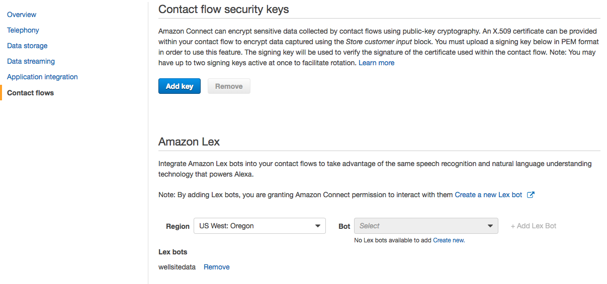
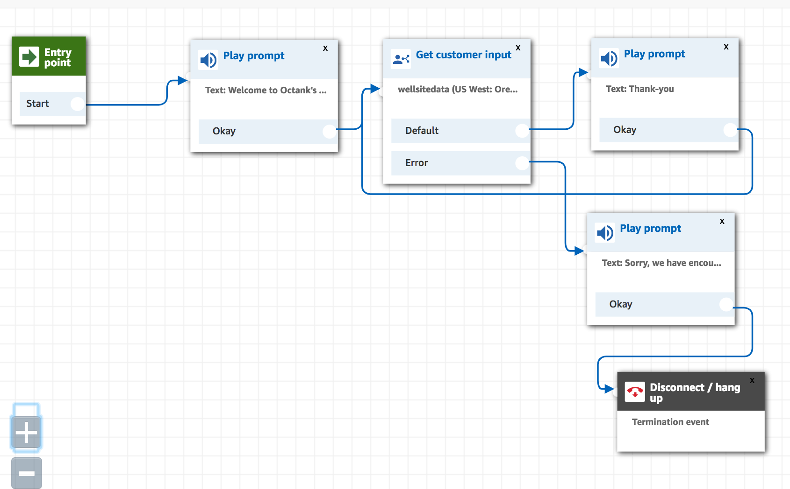

# Module 3: Integrate Amazon Lex with Amazon Connect
In this module you will integrate your Amazon Lex bot with Amazon Connect, a service that allows you to create software-defined call centers in minutes.

Upon completion, you will be able to interact with your bot using a telephone (yes, think PSTN).
To achieve this you will create a contact center, configure a simple call flow, and assign a phone number to the flow.

## Implementation Instructions

Each of the following sections provide an implementation overview and detailed, step-by-step instructions. The overview should provide enough context for you to complete the implementation if you're already familiar with the AWS Management Console or if you want to explore the services yourself without following a walkthrough.

### Create a new Amazon Conect instance
Go to the [Amazon Connect Console](https://console.aws.amazon.com/connect/home?region=us-west-2) to create a new virtual contact center instance in the us-west-2 (Oregon) region.

<strong>Step-by-step instructions (expand for details)</strong>

1. From the AWS Management Console, choose **Services** then select **Amazon Connect** under Contact Center and then **Get started**.  If you already been using Connect, then choose **Add an instance**.

1. In **Step 1: Identity management**, select **Store users within Amazon Connect** and provide a domain name (e.g. `{FirstName}` to complete the **Access URL** and click **Next step**

	> The domain name used in your contact center URL needs to be globally unique and cannot be changed.
	Alternatively, Amazon Connect can use an existing [AWS Directory Services](https://aws.amazon.com/directoryservice) directory.

1. In **Step 2: Administrator**, **Skip this** and continue with **Next step**

1. In **Step 3: Telephony options**, select **I want to handle incoming calls with Amazon Connect** and **I want to make outbound calls with Amazon Connect**

1. In **Step 4: Data storage**, accept the defaults

1. In **Step 5: Review and create**, review your settings and then select **Create Instance**

1. It will take a few minutes to setup Amazon Connect.  Just when you are thinking of going for a coffee, it will tell you **Success!**.

### Claim a phone number for your Amazon Connect instance
Once your Amazon Connect instance has been created, click **Get started** to select a phone number.

<strong>Step-by-step instructions (expand for details)</strong>

1. Select **Get started** to open the Amazon Connect Contact Center Manager (CCM) welcome screen.  When prompted, you want to allow the browser to access your microphone.  This will allow you to answer calls from your browser.

1. Select **Let's go** to claim a phone number

1. Select **Canada+1**, **Direct Dial**, and choose a phone number from the numbers provided.  Click **Next**.
    > If you are concerned about the Area Code location, you can check its geography from the following wikipedia link: https://en.wikipedia.org/wiki/List_of_North_American_Numbering_Plan_area_codes#Canada

1. You can now make a test call and get the default Connect experience.  Dial the phone number you selected in step 3 (displayed on screen) from another phone (e.g. your mobile phone).  Once connected, choose **1** from the voice menu to connect with an agent; the Amazon Connect Contract Control Panel (the current page) will then prompt you to answer the call.
	> It may take a few minutes before the claimed phone number is active.

1. Choose **Continue** to get to the Amazon Connect Contact Center Manager App (CCM).  Feel free to click around to see what is available.
    * On the screen, you will see the **Configuration Guide** that will step you through the configuration of your call center.  You can **Hide the guide** in the upper right corner.
    * Once you **Hide the guide** (in the upper right corner), you will see some basic analytics.  You should have a summary of the test calls that you made.
    * You can **configure** the appearance of your dashboard using the button on the upper right side.  Be sure you **Save** after you make your changes.
    * on the left hand side, you will see a series of icons.  This is where you access the details of Connect.  You can hover the mouse over each icon and then click on the fly-out menu.
   	> If you accepted a call, you can search for it through the Contact Search option.  Navigate with the left-hand menu and select Metrics and Quality (second icon) > Contact Search.  You can then search for your call.

### Configure contact flow
With a Connect instance and a phone number, you can now create the Contact Flow that allows callers to interact with our bot in [Module  1](../01_LexBotInformational).

<strong>Step-by-step instructions (expand for details)</strong>

1. For this next portion, you want to return to the AWS Management Console and select services **Amazon Connect**.  You should see your newly created instance on the Amazon Connect Console.

1. In the Amazon Connect Console, select your instance, then in the options menu, choose **Contact Flows**.  Scroll down until you see the `Amazon Lex` category.  Select your region and then select the Bot that you created in Module 1.

1. Make sure you click **+Add Lex Bot**.  After a few seconds, you will see the `Chatbot` appear in the list of Lex bots.  You are now ready to integrate this chatbot with Connect.

	

1. We will now return to the Connect Contact Center Manager (CCM) screen.  If you have closed the tab, you will need to re-connect by clicking on **Overview** and then **Login as administrator**.

1. Once in the Connect Contact Center Manager (CCM), use the navigation pane on the left hand side to select **Routing**(third icon) and then **Contact flows**.  The page will list all the pre-configured flows that are available to you.  You can ignore most of them and move on to the next step.

	

1. In the top right corner select **Create contact flow** to open the contact flow editor.  There are two buttons, one labelled **Create contact flow** and one with an **arrow**.  Just click on the first button.

1. Name your contact flow `FieldServiceChatbot`

1. Expand the **Interact** group of blocks and drag and drop the **Get customer input** block onto the grid

	

1. Collapse **Interact** and expand the **Terminate / Transfer** group of blocks and drag and drop the **Disconnect / Hang up** block onto the grid

	

1. Wire up the three building blocks as shown in the image below.  You click on the white-circle and drag to the connection point in the next block.

	

1. Double click on the **Get customer input** block to access its configuration

	1. Select the **Text to speech (Ad hoc)** input type and use this welcome message:  `This is the Energy Co. field service line. How can I help you today?`

	1. Keep the default 'Interpret as: Text'

	1. Scroll down and select the **Amazon Lex** tab

	1. Click in the drop-down box and wait for your list of chat-bots to populate.  Select `WellsiteBot`.

	1. You can now select your alias, such as `dev`

	1. Ignore the other options and Click **Save**

		

1. Click on the **down arrow** () next to the Save button at the top right and select **Save & Publish**

1. Wait for the contact flow to be published successfully

### Associate Contact Flow with phone number
Now you need to associate your new contact flow with your phone number

<strong>Step-by-step instructions (expand for details)</strong>

1. Select **Routing** (third icon) and **Phone Numbers** on the left hand Amazon Connect navigation pane

1. Click on the number to edit the contact flow

1. Update the description 'Contact flow for customer service chatbot'.

1. In the **Contact flow/IVR** field, search and select the `FieldServiceChatbot` contact flow.

1. Select **Save** to confirm the contact flow association

### Test your Amazon Lex enabled Amazon Connect contact flow
Dial your Amazon Connect contact center phone number to confirm functionality of contact flow and Amazon Lex integration. Ask the virtual service agent **"What is the fluid level at site 01-01-001-01W5"**.

### Make phone number available to the bot
In this last step we are enhancing the customer input configuration of the contact flow to make the caller's phone number available to the bot.

 

<strong>Step-by-step instructions (expand for details)</strong>

1. Re-open the CCM app; within the [Amazon Connect console](https://console.aws.amazon.com/connect/home?region=us-west-2) select **Overview** and **Login as administrator**

1. On the left hand navigation select **Routing** (third icon) - **Contact flows**

	

1. Click the `FieldServiceChatbot` flow to open the flow

1. Click the **Get customer input** block to access its configuration

1. Scroll to the bottom and under **Session attributes** click **Add an attribute**

1. Select **Use attribute** and enter the following

    1. Destination Key:  `IncomingNumber`
	1. Type: **System**
	1. Attribute: **Customer Number**

1. Click **Add another attribute**

1. Select **Use text** and enter the following

    1. Destination Key: `Source`
	1. Value: `AmazonConnect`

1. Select **Save**

1. Click on the **down arrow** () next to the save button and select **Save & Publish**

1. Confirm publishing of the workflow in selecting the **Save & publish** button
 	

### Test your bot with Amazon Connect
Call your Amazon Connect phone number to interact with your bot over the phone.  Ask the virtual service agent **"What international plans do you have?"**. When asked for your pin code enter the last four digits of the phone number you are calling from.

