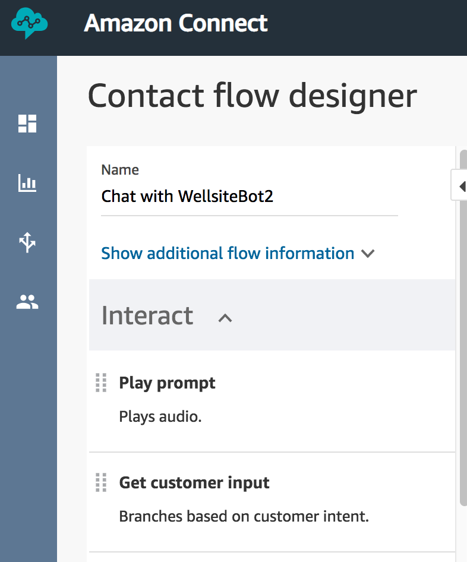
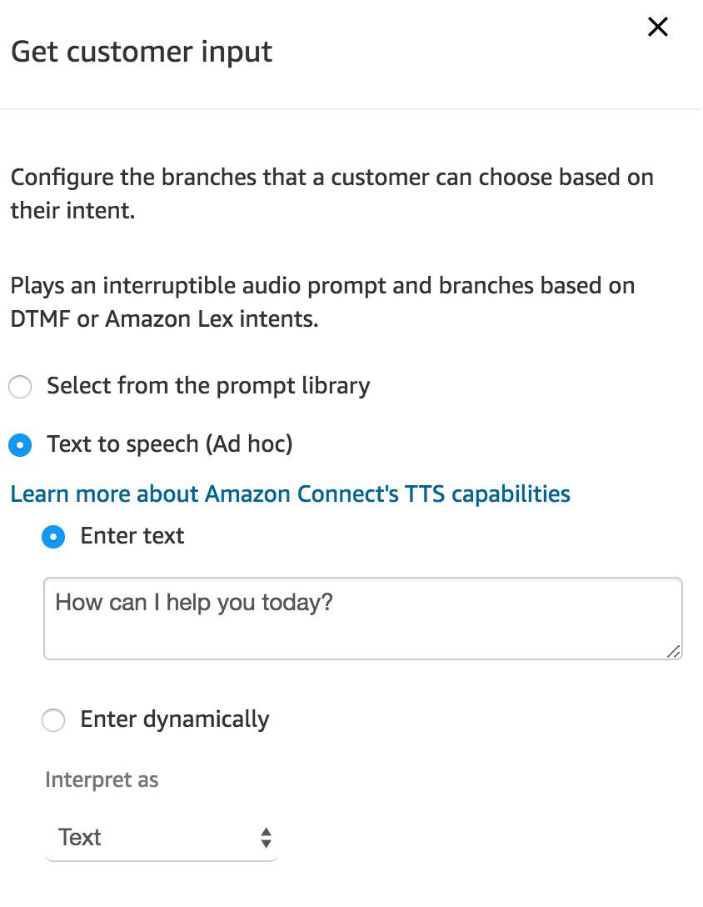
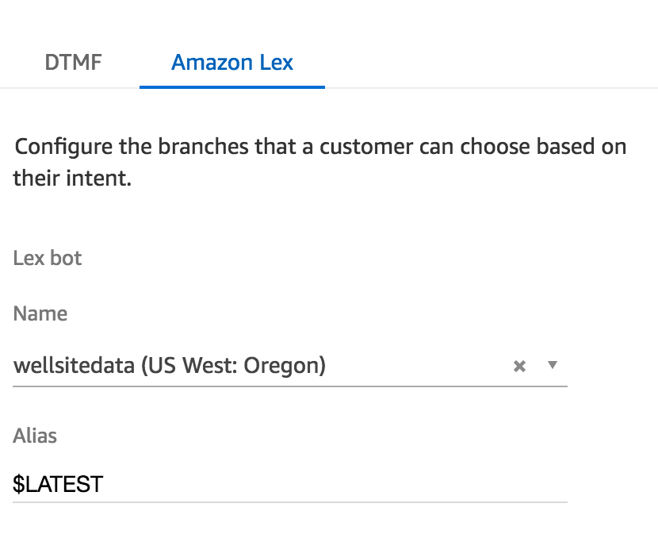
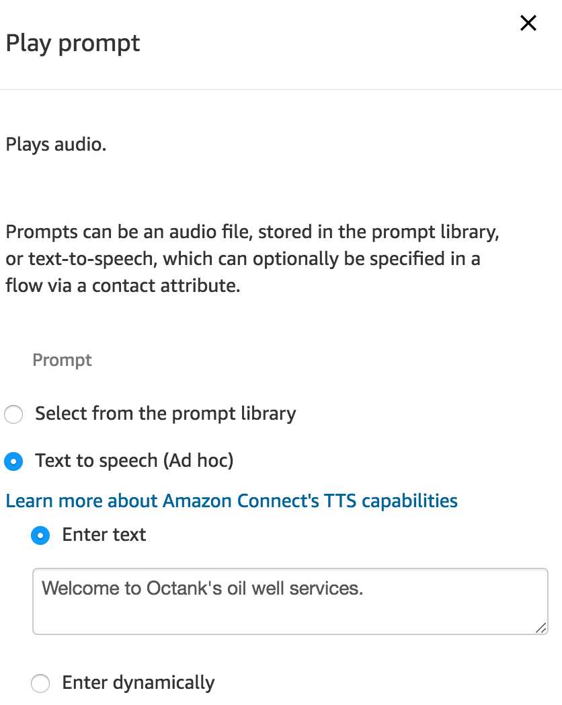
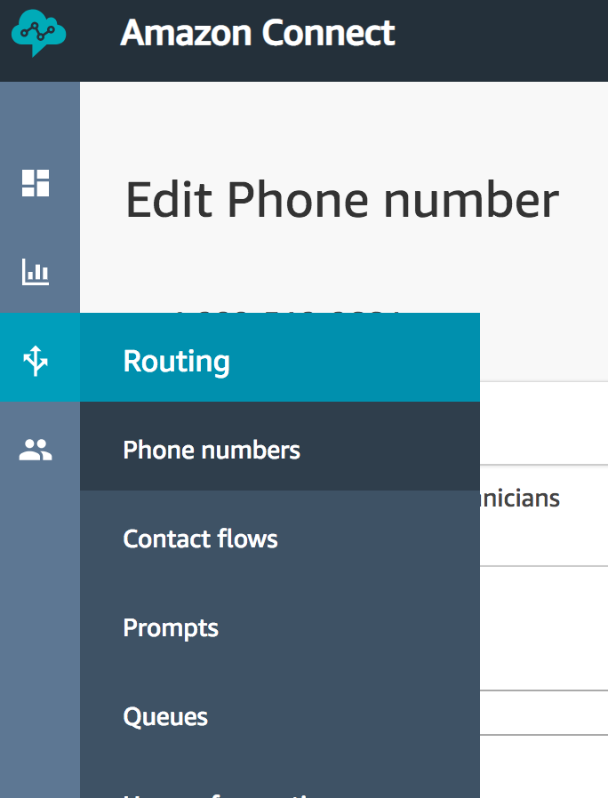
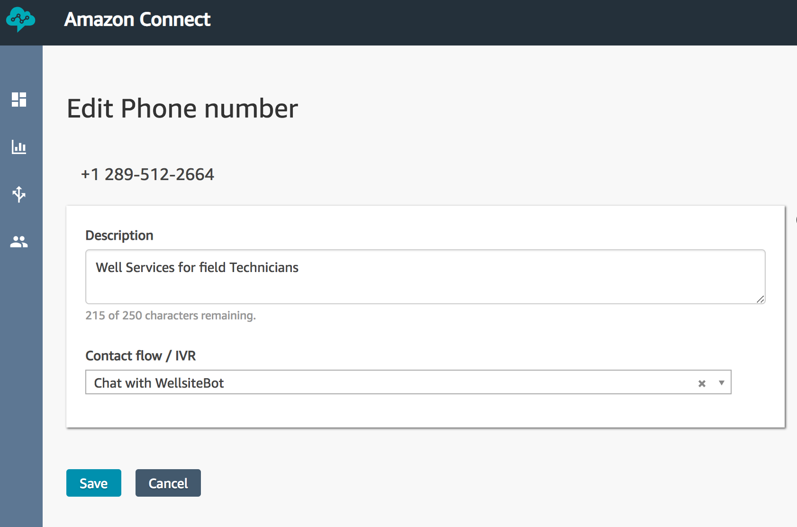

# Module 3: Integrate Amazon Lex with Amazon Connect

In this module you will integrate your Amazon Lex bot with Amazon Connect, a service that allows you to create software-defined call centers in minutes.

Upon completion, you will be able to interact with your bot using a telephone (yes, think PSTN).
To achieve this you will create a contact center, configure a simple call flow, and assign a phone number to the flow.

## Implementation Instructions

Each of the following sections provide an implementation overview and detailed, step-by-step instructions. The overview should provide enough context for you to complete the implementation if you're already familiar with the AWS Management Console or if you want to explore the services yourself without following a walkthrough.

### Create a new Amazon Conect instance

Go to the [Amazon Connect Console](https://console.aws.amazon.com/connect/home?region=us-west-2) to create a new virtual contact center instance in the us-west-2 (Oregon) region.

<strong>Step-by-step instructions (expand for details)</strong>

1. From the AWS Management Console, choose **Services** then select **Amazon Connect** under Contact Center and then **Get started**.  If you already been using Connect, then choose **Add an instance**.

1. In **Step 1: Identity management**, select **Store users within Amazon Connect** and provide a domain name (e.g. `YourName` to complete the **Access URL** and click **Next step**

	> The domain name used in your contact center URL needs to be globally unique and cannot be changed.
	Alternatively, Amazon Connect can use an existing [AWS Directory Services](https://aws.amazon.com/directoryservice) directory.

1. In **Step 2: Administrator**, **Skip this** and continue with **Next step**

1. In **Step 3: Telephony options**, select **I want to handle incoming calls with Amazon Connect** and **I want to make outbound calls with Amazon Connect**

1. In **Step 4: Data storage**, accept the defaults

1. In **Step 5: Review and create**, review your settings and then select **Create Instance**

1. It will take a few minutes to setup Amazon Connect.  As you are watching and thinking of going for a coffee, it will finish with **Success!**.

### Claim a phone number for your Amazon Connect instance

Once your Amazon Connect instance has been created, click **Get started** to select a phone number.

<strong>Step-by-step instructions (expand for details)</strong>

1. Select **Get started** to open the Amazon Connect Contact Center Manager (CCM) welcome screen. Your browser may prompt you to allow access to your computer's microphone. This is for the case where a human agent would be answering incoming calls. You can safely decline to allow microphone access.

1. Select **Let's go** to claim a phone number

1. Select **Canada+1**, **Direct Dial**, and choose a phone number from the numbers provided.  Click **Next**.
    > If you are concerned about the Area Code location, you can check its geography from the following Wikipedia link: https://en.wikipedia.org/wiki/List_of_North_American_Numbering_Plan_area_codes#Canada

1. Choose **Continue** to get to the Amazon Connect Contact Center Manager App (CCM).  Feel free to click around to see what is available.
    * On the screen, you will see the **Configuration Guide** that will step you through the configuration of your call center.  You can **Hide the guide** in the upper right corner.
    * Once you **Hide the guide** (in the upper right corner), you will see some basic analytics.
    * You can **configure** the appearance of your dashboard using the button on the upper right side.  Be sure you **Save** after you make your changes.
    * On the left hand side, you will see a series of icons. This is where you access the details of Connect.  You can hover the mouse over each icon and then click on the fly-out menu.

### Configure contact flow
With a Connect instance and a phone number, you can now create the Contact Flow that allows callers to interact with the chatbot.

<strong>Step-by-step instructions (expand for details)</strong>

1. For this next portion, you want to return to the AWS Management [Console](https://console.aws.amazon.com/lex/home?region=us-west-2) and select services **Amazon Connect**.  You should see your newly created instance on the Amazon Connect Console.

1. In the Amazon Connect Console, select your instance, then in the options menu, choose **Contact Flows**.  Scroll down until you see the `Amazon Lex` category.  Select your region (us-west-2, Oregon) and then select `WellsiteBot`.

1. Make sure you click **+Add Lex Bot**.  After a few seconds, you will see the `WellsiteBot` appear in the list of Lex bots.  You are now ready to integrate this chatbot with Connect.

	

1. We will now return to the Connect Contact Center Manager (CCM) screen.  If you have closed the tab, you will need to re-connect by clicking on **Overview** and then **Login as administrator**.

1. Once in the Connect Contact Center Manager (CCM), use the navigation pane on the left hand side to select **Routing** (third icon) and then **Contact flows**.  The page will list all the pre-configured flows that are available to you.  You can ignore most of them and move on to the next step.

	

1. In the top right corner select **Create contact flow** to open the contact flow editor.  There are two buttons, one labelled **Create contact flow** and one with an **arrow**.  Just click on the first button.

1. Name your contact flow `Chat with WellsiteBot`

1. We will now build the contact flow as seen in the following diagram.

	

1. Start by expanding the **Interact** group of blocks and drag and drop the **Play Prompt** block onto the grid.

	

1. Expand the **Interact** group of blocks and drag and drop the **Get customer input** block onto the grid

1. Expand the **Interact** group of blocks and drag and drop a **Play Prompt** block onto the grid

1. Expand the **Interact** group of blocks and drag and drop another **Play Prompt** block onto the grid

1. Collapse **Interact** and expand the **Terminate / Transfer** group of blocks and drag and drop the **Disconnect / Hang up** block onto the grid

1. We will now define the contact flow logic by connecting these building blocks.  You click on the white-circle and drag to the connection point in the next block.
Click <a href="https://raw.githubusercontent.com/knightjoel/amazon-lex-customerservice-workshop/master/03_AmazonConnectIntegration/images/contact_flow_wiring.png">
here</a> for a high-res image of the call flow.

	

1. Everything is wired up and now we need to specify our custom text.  Double click on the **Get customer input** block to access its configuration

	1. Select the **Text to speech (Ad hoc)** input type and use this welcome message:  `How can I help you today?`

		

	1. Keep the default 'Interpret as: Text'

	1. Scroll down and select the **Amazon Lex** tab

		

	1. Click in the drop-down box and wait for your list of chat-bots to populate.  Select `WellsiteBot`.

	1. You can now select your alias, such as `$LATEST`

	1. Ignore the other options and Click **Save**

1. Time to update our voice prompts.  Double click on the **Play Prompt** block to access its configuration.  This message will be spoken when you first connect to the chatbot.

		

	1. Select the **Text to speech (Ad hoc)** input type and use this welcome message:  `Welcome to Octank's oil well services.`

	1. Click **Save**

1. Double click on the next **Play Prompt** block to access its configuration.  This block will give you a confirmation after the chatbot has answered your question.

	1. Select the **Text to speech (Ad hoc)** input type and use this welcome message:  `Thank-you.`

	1. Click **Save**

1. Double click on the final **Play Prompt** block to access its configuration.  This block will tell you when you have encountered an error.

	1. Select the **Text to speech (Ad hoc)** input type and use this welcome message:  `Sorry.  You have encountered an error.  Please call back later.`

	1. Click **Save**

1. Everything is wired up.  Click on the **down arrow** () next to the Save button at the top right and select **Save & Publish**

1. Wait for the contact flow to be published successfully

### Associate Contact Flow with phone number

Now you need to associate your new contact flow with your phone number

<strong>Step-by-step instructions (expand for details)</strong>

1. Select **Routing** (third icon) and **Phone Numbers** on the left hand Amazon Connect navigation pane

	

1. Click on the number to edit the contact flow

	

1. Update the description 'Contact flow for customer service chatbot'.

1. In the **Contact flow/IVR** field, search and select the `Chat with WellsiteBot` contact flow.

1. Select **Save** to confirm the contact flow association

### Test your Amazon Lex enabled Amazon Connect contact flow
Dial your Amazon Connect contact center phone number to confirm functionality of contact flow and Amazon Lex integration. Ask the virtual service agent **"What is the fluid level at site 1 dash 1 dash 1 dash 1 dash w5"**.

### Optional Improvement ###

### Make phone number available to the bot

In this last step we are enhancing the customer input configuration of the contact flow to make the caller's phone number available to the bot.

 

<strong>Step-by-step instructions (expand for details)</strong>

1. Re-open the CCM app; within the [Amazon Connect console](https://console.aws.amazon.com/connect/home?region=us-west-2) select **Overview** and **Login as administrator**

1. On the left hand navigation select **Routing** (third icon) - **Contact flows**

	

1. Click the `Chat with WellsiteBot` flow to open the flow

1. Click the **Get customer input** block to access its configuration

1. Scroll to the bottom and under **Session attributes** click **Add an attribute**

1. Select **Use attribute** and enter the following

    1. Destination Key:  `IncomingNumber`
	1. Type: **System**
	1. Attribute: **Customer Number**

1. Click **Add another attribute**

1. Select **Use text** and enter the following

    1. Destination Key: `Source`
	1. Value: `AmazonConnect`

1. Select **Save**

1. Click on the **down arrow** () next to the save button and select **Save & Publish**

1. Confirm publishing of the workflow in selecting the **Save & publish** button
 	

