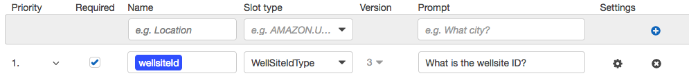

# Build the "site visit" intent

In this module you will add a new intent to your `WellsiteBot` bot that allows a site operator to retrieve and update information about a well during a site visit.

At completion of this module you will be able to test out your chatbot by making a statement like "*I am doing an inspection at 01-01-001-01-W5*"

## Implementation Instructions

Each of the following sections provide an implementation overview and detailed, step-by-step instructions. The overview should provide enough context for you to complete the implementation if you're already familiar with the AWS Management Console or you want to explore the services yourself without following a walkthrough.

### Create WellsiteVisit intent

Create a new intent named `WellsiteVisit` in the Lex bot

<strong>Step-by-step instructions (expand for details)</strong>

1. Go to the Lex [Console](https://console.aws.amazon.com/lex/home?region=us-west-2).

1. In the `WellsiteBot` Lex bot, click the **+** next to `Create Intent` in the left-hand menu

1. Pick **Create new intent**

1. Give the intent a name, `WellsteVisit`, then click **Add**

### Configure Slots

Slots are parameters you can define to capture inputs from the bot users. In this example, the bot needs multiple input parameters in order to fulfill the site visit checklist.

Each slot has a type. You can create your **custom slot types** or use **built-in slot types**. There is a [list](http://docs.aws.amazon.com/lex/latest/dg/howitworks-builtins-slots.html) of **Built-in Slot Types** if you wish to browse it.

We are going to reuse the `WellSiteIdType` we created earlier but we also need a new type to capture the condition of the rod.

Configure a new slot type `RodConditionType` by clicking the **+** button next
to `Slot types` in the left-hand menu.

1. Choose **Create slot type**

1. Slot type name: **RodConditionType**

1. Description: ***optional***

1. Slot Resolution: **Restrict to Slot values and Synonyms**

1. Value: Enter the value **Poor** and synonym **Bad**. Hit the **+** button.

1. Repeat the above step for these values:
	- **Fair**
	- **Good**
	- **Excellent**
	- **Replace**

1. Click **Save slot type**

Add a slot named `wellsiteId` to the `WellsiteVisit` intent.

<strong>Step-by-step instructions (expand for details)</strong>

1. In the **Slots** section of the `WellsiteVisit` intent, fill in `wellSiteId` for the slot **Name**

1. Select `WellSiteIdType` for **Slot type**

1. For **Prompt**, put in `What is the wellsite ID?`

1. Check the box to indicate the slot is **required**

1. Click the (+) sign to add the slot

	

Add a slot named `operatorName` to the `WellsiteVisit` intent.

<strong>Step-by-step instructions (expand for details)</strong>

1. In the **Slots** section of the `WellsiteVisit` intent, fill in `operatorName` for the slot **Name**

1. Select `AMAZON.US_FIRST_NAME` for **Slot type**

1. For **Prompt**, put in `What is your name?`

1. Check the box to indicate the slot is **required**

1. Click the (+) sign to add the slot

Add a slot named `timeOnSite` to the `WellsiteVisit` intent.

<strong>Step-by-step instructions (expand for details)</strong>

1. In the **Slots** section of the `WellsiteVisit` intent, fill in `timeOnSite` for the slot **Name**

1. Select `AMAZON.NUMBER` for **Slot type**

1. For **Prompt**, put in `How many hours were you on site?`

1. Check the box to indicate the slot is **required**

1. Click the (+) sign to add the slot

Add a slot named `rodCondition` to the `WellsiteVisit` intent.

<strong>Step-by-step instructions (expand for details)</strong>

1. In the **Slots** section of the `WellsiteVisit` intent, fill in `rodCondition` for the slot **Name**

1. Select `RodConditionType` for **Slot type**

1. For **Prompt**, put in `What is the condition of the rod?`

1. Check the box to indicate the slot is **required**

1. Click the (+) sign to add the slot

Add a slot named `fluidLevel` to the `WellsiteVisit` intent.

<strong>Step-by-step instructions (expand for details)</strong>

1. In the **Slots** section of the `WellsiteVisit` intent, fill in `fluidLevel` for the slot **Name**

1. Select `AMAZON.NUMBER` for **Slot type**

1. For **Prompt**, put in `What is the fluid level in meters?`

1. Check the box to indicate the slot is **required**

1. Click the (+) sign to add the slot

### Configure sample utterances

By providing sample utterances for a given intent, you can teach Amazon Lex different ways a user might convey an intent.

Add the following sample utterances to the `WellsiteVisit` intent:

* `inspect`
* `inspect {wellsiteId}`
* `I am inspecting wellsite {wellsiteId}`
* `I am doing an inspection at {wellsiteId}`

> Note that you don't need to list exhaustively every possible way of saying the same intent, just a few examples so the Amazon Lex deep learning algorithms can "learn".
>
> However, if during testing you identified some additional ways to express the intent and Lex doesn't understand it, you can add that as a sample utterance to improve the Lex bot.

### Test the site visit intent

Save the intent, build and test the bot in the Lex Console.

<strong>Step-by-step instructions (expand for details)</strong>

1. Click **Save Intent** to save the intent configuration

1. Click **Build** at the top right of the page to build the bot

1. Once the build completes, use the **Test Bot** window to test the site visit intent by typing "**I am doing an inspection at 1 dash 1 dash 1 dash 1 dash w5**". Verify that the bot is able to detect the intent.  The unusual format for the wellsite id is because we need to simulate the voice interface from Connect.

	

Now test the bot via Amazon Connect by phoning into the bot.

<strong>Step-by-step instructions (expand for details)</strong>

1. Dial the phone number that is assigned to your bot

1. Issue the command `I am starting an inspection at site 1 dash 1 dash 1 dash 1 dash w5`

1. Answer each question the bot prompts you with:

	- What is your name? *Name*
	- How many hours on site? **2**
	- What is the condition of the rod? Answer with one of **Excellent**, **Good**, **Poor**, or **Bad**
	- Did you replace the rod? **Yes** or **No**
	- What is the fluid level? **31**

1. The bot should respond that your visit has been recorded in the database.

Now check the fluid level to confirm the bot recorded your visit in the database.

<strong>Step-by-step instructions (expand for details)</strong>

1. Dial the phone number that is assigned to your bot

1. Issue the utterance `fluid level at 1 dash 1 dash 1 dash 1 dash w5`

1. The bot should respond with the fluid level you just gave it along with your name and the date.

